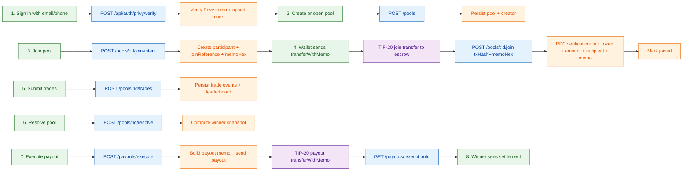
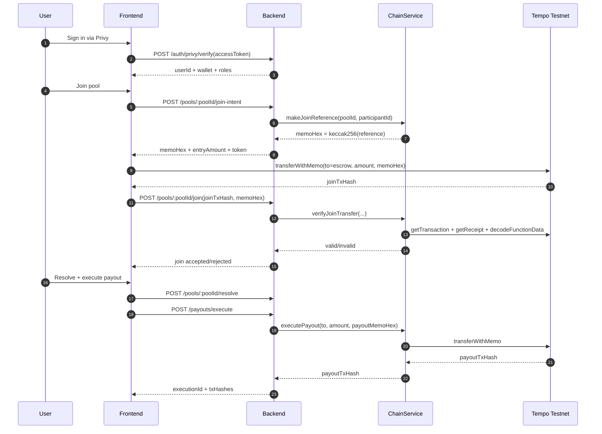

# Pulsar Predict
### Instant Social Prediction Pools on Tempo (Privy-authenticated, memo-auditable stablecoin settlement)

Pulsar Predict is a hackathon demo for **Canteen x Tempo** that makes prediction pools feel like a consumer app: sign in with email/phone, join pools in one tap, and settle winnings instantly in stablecoins.

It is designed to showcase Tempo-native primitives for social finance:
- **Privy authentication** (email/phone → wallet UX)
- **TIP-20 stablecoin transfers with memos**
- **Deterministic memo references** for transparent join/payout accounting
- **Backend verification** of on-chain join transactions before admission
- **Operator payout execution tracking** for transparent auditability

---

## 🎥 Demo
- Demo video: 'https://www.youtube.com/watch?v=lHoL5Mmp8uA'
- Live deployment: 'https://tempo-hackathon-inky.vercel.app/'
- Tempo explorer base: `https://explore.tempo.xyz`

---

## ⚡ Why this project
Consumer prediction and social-finance products should feel instant and familiar. Most crypto products fail here because they force users through wallet friction and opaque settlement.

**Pulsar Predict** abstracts that complexity by combining:
1. **Privy login UX** so users authenticate with phone/email,
2. **Tempo stablecoin rails** for fast settlement,
3. **Memo-linked lifecycle events** so every join and payout is traceable.

---

## 🧭 Core User Flow
1. User logs in with Privy (email/phone).
2. User creates or joins a prediction pool.
3. Backend issues a deterministic `joinReference` and `memoHex`.
4. User submits on-chain entry transfer via TIP-20 `transferWithMemo`.
5. Backend verifies tx correctness (token, recipient, amount, memo, success).
6. User submits prediction trades.
7. Pool is resolved.
8. Operator executes payout and winner receives stablecoins.
9. Payout execution is queryable via execution status endpoint.

---

## 🏗️ Architecture

### 1) End-to-end flow (UX + system)


### 2) Technical sequence


---

## 🧩 Tempo + Privy primitives showcased

### Privy
- Email/phone login and wallet abstraction.
- Auth token verification in backend and frontend API route.

### Tempo
- TIP-20 `transferWithMemo` for joins and payouts.
- Memo hashing (`keccak256`) to bind off-chain pool state to on-chain transfers.
- Fast stablecoin settlement rails for social-finance UX.

---

## ✨ Feature highlights
- **Pool lifecycle:** create, join intent, join confirmation, resolve, payout.
- **On-chain join integrity:** tx is rejected unless function, token, recipient, amount, and memo all match expected values.
- **Leaderboards:** trade events can be synced and scored.
- **Payout observability:** execution IDs, tx hashes, and failures are queryable.
- **Clear technical narrative:** architecture and sequence diagrams included.

---

## 🛠️ Tech stack
- **Frontend:** Next.js 14, React, Tailwind, Zustand
- **Auth:** Privy (`@privy-io/react-auth`, `@privy-io/node`)
- **Backend:** NestJS, TypeORM, Postgres
- **Chain:** Viem + Tempo RPC (Moderato testnet)
- **Testing:** Vitest (frontend)

---

## 📁 Monorepo structure
```text
.
├── frontend/   # Next.js app, Privy UI/auth integration, pool gameplay UI
├── backend/    # NestJS API, auth guard, pool + payout services, chain verification
└── README.md
```

---

## 🚀 Local setup

### 1) Prerequisites
- Node.js 20+
- pnpm 9+
- Postgres (optional but recommended for full persistence)

### 2) Install dependencies
```bash
cd frontend && pnpm install
cd ../backend && pnpm install
```

### 3) Configure environment

#### Frontend (`frontend/.env.local`)
```bash
cp frontend/.env.example frontend/.env.local
```
Set:
- `NEXT_PUBLIC_PRIVY_APP_ID`
- `NEXT_PUBLIC_PRIVY_CLIENT_ID`
- `PRIVY_APP_ID`
- `PRIVY_APP_SECRET`
- `NEXT_PUBLIC_BACKEND_URL=http://localhost:4000`
- `NEXT_PUBLIC_DEMO_TOKEN_ADDRESS`
- `NEXT_PUBLIC_OPERATOR_ESCROW_ADDRESS`

#### Backend (`backend/.env`)
```bash
cp backend/.env.example backend/.env
```
Set:
- `PORT=4000`
- `FRONTEND_ORIGIN=http://localhost:3000`
- `DATABASE_URL`
- `PRIVY_APP_ID`
- `PRIVY_APP_SECRET`
- `TEMPO_RPC_URL=https://rpc.moderato.tempo.xyz`
- `TEMPO_CHAIN_ID=42431`
- `DEMO_TOKEN_ADDRESS`
- `OPERATOR_ESCROW_ADDRESS`
- `OPERATOR_PRIVATE_KEY`

### 4) Run apps
```bash
# terminal 1
cd backend
pnpm start:dev

# terminal 2
cd frontend
pnpm dev
```

Frontend: `http://localhost:3000`  
Backend: `http://localhost:4000`

---

## 🧪 Testing
```bash
cd frontend
pnpm test:run
```

---

## 🧑‍⚖️ Hackathon judging alignment

### Track fit
Primarily aligned with **Track 1: Consumer Payments & Social Finance**:
- Privy-authenticated consumer UX
- One-tap pool participation
- Stablecoin settlement with transparent memos

Secondary alignment with **Track 3 (Agentic/Automation path)**:
- Deterministic memo references and execution IDs make it straightforward to automate settlement operations.

### Quick verification checklist
1. Create pool.
2. Generate join intent and inspect returned memo.
3. Submit join tx and confirm backend validation.
4. Resolve pool and execute payout.
5. Open tx hash on Tempo explorer.
6. Query payout execution status.

---

## 🔭 Roadmap
- Fee sponsorship for gasless joins.
- Parallel and batch payouts for large pools.
- Contact-based invite UX (email/phone lookup).
- Push notifications for join confirmation and payout events.

---

## 📜 License
MIT (or project team preferred license).
